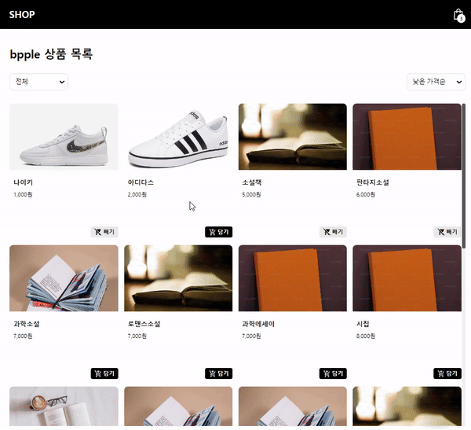
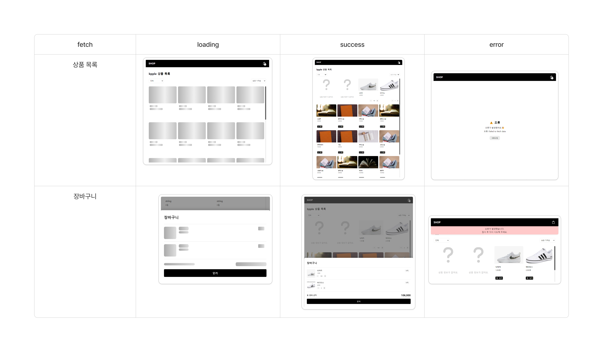
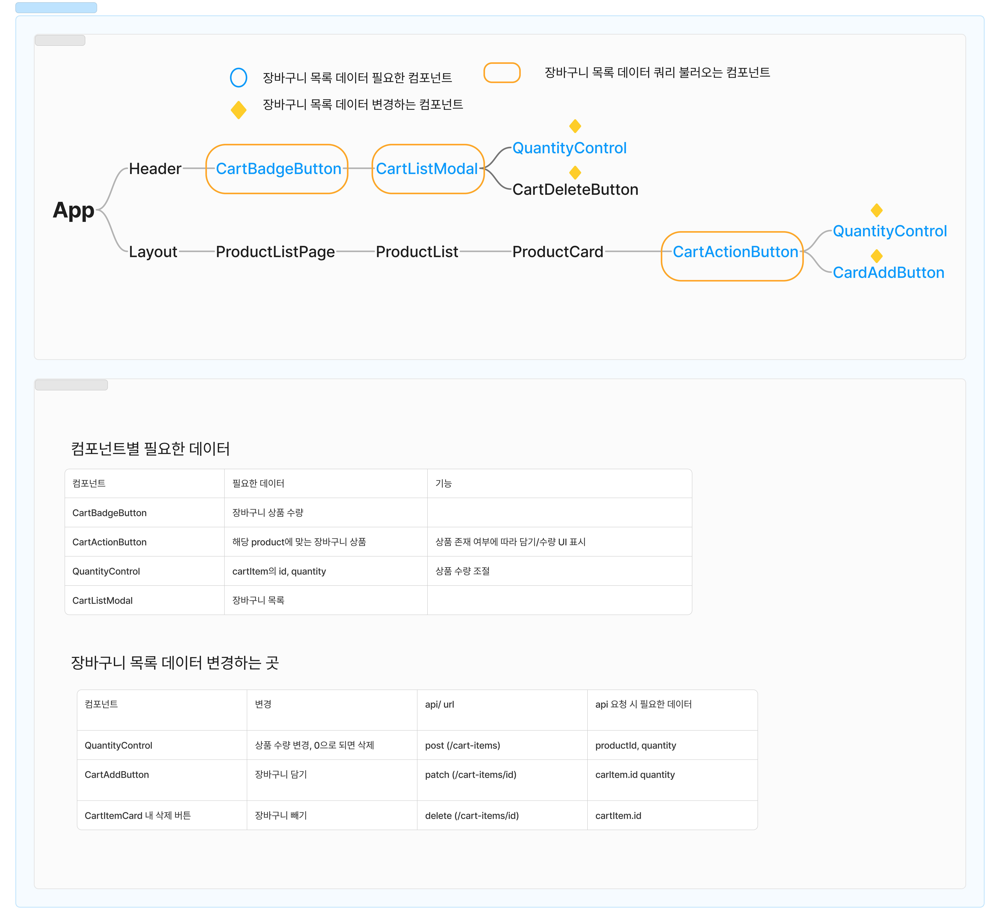

# react-shopping-products

## 배포

[🌟 배포 페이지 바로가기](https://badahertz52.github.io/react-shopping-products/)

### 구현 화면

#### step1



#### step2


#### 데이터 fetch 결과에 따른 UI



## 기술 스택

- React (with Vite)
- TypeScript
- css module
- 테스트 : vitest, msw

## 빌드 및 테스트

```dash
//빌드
npm run build

//테스트
npm run test
```

## 기능 구현 목록

<details>
  <summary>💫 1단계 기능 구현 목록</summary>
  <div markdown="1">

### 상품 목록 조회

- /products API로 상품 목록 데이터를 가져온다.
  - 맨 처음 불러 오는 갯수는 20개다.
  - 이 후 추가로는 4개씩 불러온다. -상품 목록을 무한스크롤 방식으로 표시한다.

### 상품 정렬 및 필터링

- 상품 필터링

  - 카테고리

  전체:cateogory 빈칸
  fashion :패션의류/잡화
  beverage :음료
  electronics : 가전 디지털
  kitchen : 주방용품
  fitness : 운동
  books :도서

- 상품 정렬
  - 낮은 가격 순
  - 높은 가격 순

### 상품 장바구니 담기

- 사용자가 담기 버튼을 누르면, 장바구니에 추가된다.

  - 이 때 장바구니에 담긴 아이템 '종류' 의 갯수로 숫자를 표시한다.
  - 장바구니 담기 요청 중 에러가 발생한 경우, 에러 메시지를 사용자에게 알려주는 UI를 표시한다.

- 장바구니에서 빼기 버튼을 누르면, 장바구니에서 해당 아이템이 제거된다.

  - 이 때 장바구니에 담긴 아이템 '종류' 의 갯수로 숫자를 표시한다.
  - 장바구니 담기 요청 중 에러가 발생한 경우, 에러 메시지를 사용자에게 알려주는 UI를 표시한다.

    </div>
  </details>

<details>
  <summary>💫 2단계 기능 구현 목록</summary>
  <div markdown="1">
  
### <div id="step2-plan__quantity">수량 버튼에 따른 장바구니 업데이트</div>
- 상품 수량 +/- 버튼에 따라 장바구니에 업데이트 된다.
  - react-query를 사용해 업데이트 진행
- 상품 수량이 0이 되면, 장바구니에서 상품을 삭제한다.

### 상품 목록

- 장바구니에 담겨있는지 여부에 따라 담기/수량 버튼을 표시한다.
  - 장바구니에 담겨있으면 수량 버튼
  - 장바구니에 없으면 담기 버튼
- 담기 버튼 클릭 시 장바구니 목록에 수량 1개로 상품이 장바구니에 담기고, 담기 버튼이 아닌 수량 버튼이 표시된다.
  - 수량버튼에서 수량이 0이되면 장바구니 목록에서 삭제되고, 담기 버튼으로 바뀐다.

### 장바구니

#### 모달

- 장바구니 버튼을 클릭하면 장바구니 목록에 대한 모달의 띄운다.
  - 닫기 클릭 시 모달 닫기

#### 로딩, 오류 처리

- 장바구니 목록 api 요청 오류 처리
- 장바구니 목록 로딩 처리
-

#### 수량 버튼

- 수량 버튼에 따라 장바구니를 업데이트한다.
  - 자세한 사항은 <span id="#step2-plan__quantity">'수량 버튼에 따른 장바구니 업데이트'</span>를 참고한다.

#### 삭제 버튼

- 삭제 버튼을 누르면, 장바구니에서 상품을 삭제한다.

#### 총 결제 금액

- 장바구니 목록 데이터를 기반으로 총 결제 금액을 계산한다.
- 장바구니 목록이 변경되면 총 결제 금액도 변경된다.

  </div>
</details>

## 장바구니 목록 구조,로직 정리


